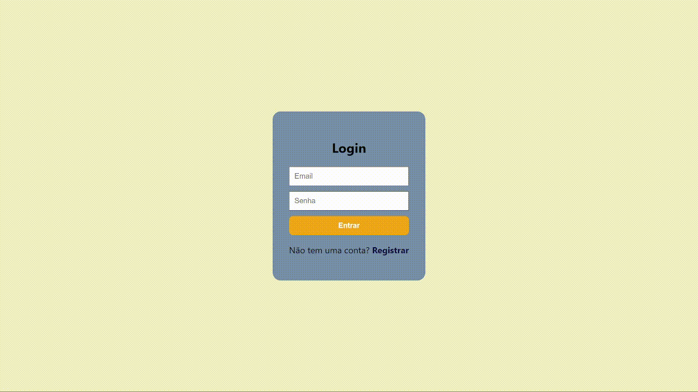
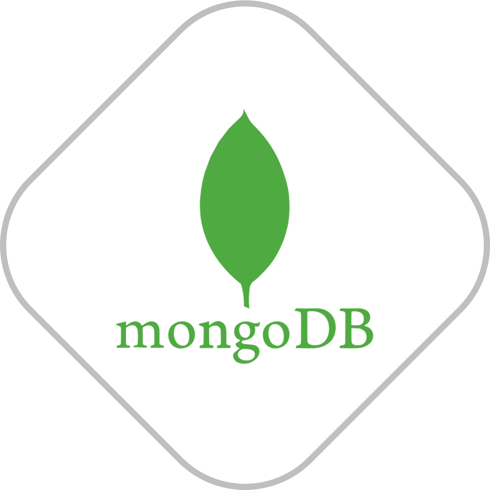
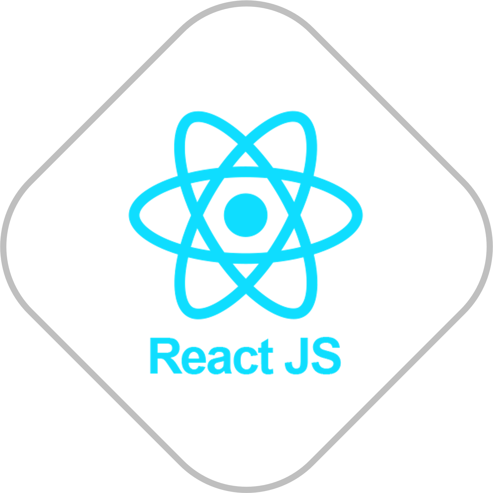
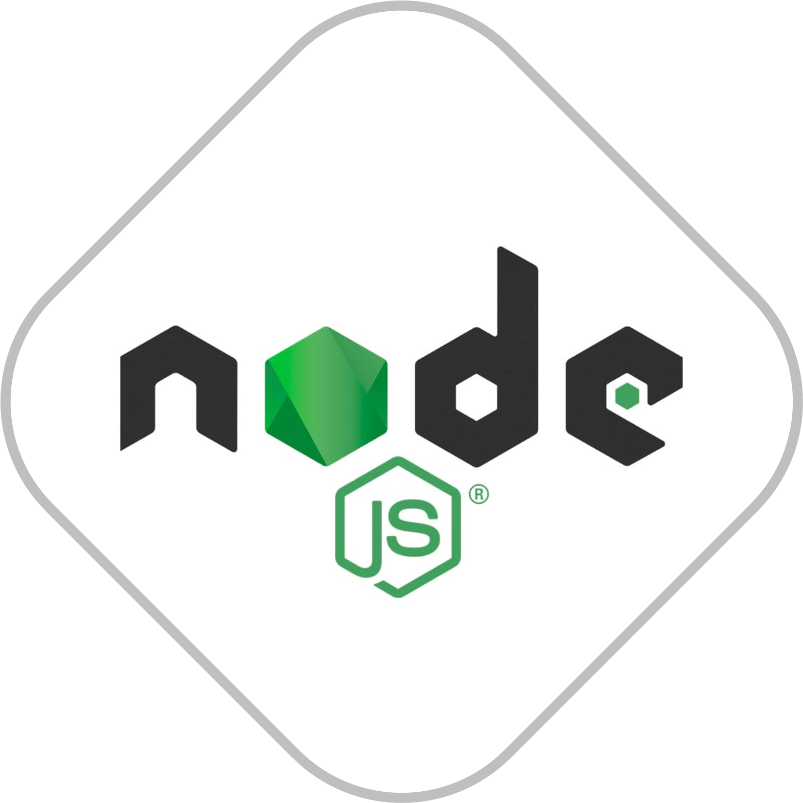

<h1 align="left">MERN-SignUp</h1>

## 💬 Sobre

Este é um site de login e cadastro de usuários, criado como parte de um projeto do segundo semestre da faculdade na disciplina de Desenvolvimento Web Avançado (DWEA) do IFSP Cubatão.
   

## 🌟 Integrantes

Integrantes do grupo responsáveis por cada tarefa:

- **Banco de dados:** Miguel Luizatto e Beatriz Bastos
- **Backend:** [Lucas Lopes](https://github.com/LucasLoopsT) e Laysa Bernardes
- **Frontend:** Edu Fodor
 

## 🚀 Tecnologias

 

 Utilizamos MongoDB, Express, React e Node.js para criar uma plataforma de registro simples e eficaz. Explorando o código você poderá ver melhor o trabalho realizado com essas tecnologias avançadas que foram incorporadas neste projeto! 

 
 

## 📌 Nota

Para que o Frontend e o Backend funcione, siga os passos abaixo:

- **Config Frontend:**
  - Abra o terminal integrado do Frontend e escreva *"npm install"*
  - Após isso, com o terminal do Frontend aberto, digite *"npm start"*
 

- **Config Backend:**
  - Abra o terminal integrado do Backend e escreva *"npm install"*
  - Após isso, com o terminal do Frontend aberto, digite *"npm start"*
 

## ✏️ Documentação

- Tutorial da Aplicação (PDF): [Clique aqui](preview/MERN-SignUp.pdf)

## 🚀 Deploy

Este projeto foi implantado e está acessível online. Você pode acessar as rotas do backend [aqui](https://api-login-0qlo.onrender.com/doc/) e ver a parte do frontend do projeto [aqui](https://laysabernardes.github.io/Login-FrontEnd/).

## 🤝 Futuro do Projeto

Este projeto foi desenvolvido em grupo como parte de um projeto acadêmico, mas tenho planos de continuar trabalhando nele. Meu objetivo é transformar essa página de login em um blog de postagem, onde os usuários poderão fazer login, ter um perfil próprio, criar textos e compartilhá-los com a rede. Para isso, planejo adicionar rotas e funções para criar, deletar e atualizar postagens. Aqui estão alguns passos que pretendo seguir:

- [ ] Criar um sistema de autenticação de usuário.
- [ ] Desenvolver um sistema de gerenciamento de perfil de usuário.
- [ ] Implementar a capacidade de criar, editar e excluir postagens.
- [ ] Adicionar funcionalidades de compartilhamento e interação social.

Fique à vontade para contribuir ou entrar em contato caso tenha ideias para melhorias ou queira fazer parte deste projeto em evolução!
